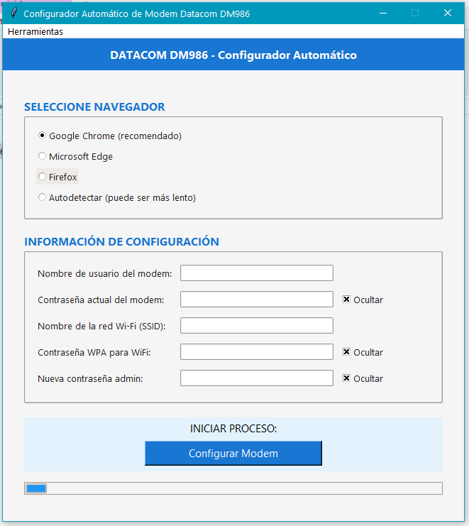

# DM986-416AX30 - Configurador Automático de Modem Datacom

## 📡 Descripción

El Configurador Automático de Modem Datacom DM986 es una herramienta diseñada para simplificar y automatizar el proceso de configuración de modems Datacom DM986-416AX30. Esta aplicación utiliza Selenium para interactuar con la interfaz web del modem, permitiendo configurar en un solo paso diferentes aspectos críticos como la configuración WAN, redes WiFi (2.4GHz y 5GHz) y parámetros de seguridad.

## 📸 Capturas de Pantalla

### Archivo ejecutable en la carpeta dist


### Interfaz principal de la aplicación


## ✨ Características Principales

- **Configuración WAN automática**:
  - Activación de VLAN con ID 500
  - Configuración de modo de canal IPoE
  - Mapeo de puertos automático

- **Configuración WiFi completa**:
  - Configuración simultánea de bandas 2.4GHz y 5GHz
  - Optimización de ancho de canal (40MHz para 2.4GHz y 160MHz para 5GHz)
  - Configuración de potencia de transmisión al 100%
  - Selección automática de canales

- **Configuración de Seguridad**:
  - Establecimiento de contraseñas WPA para redes WiFi
  - Cambio de contraseña de administrador
  - Activación de acceso remoto por HTTPS

- **Funciones adicionales**:
  - Interfaz gráfica amigable
  - Sistema de registros (logs) completo
  - Soporte para múltiples navegadores (Chrome, Edge, Firefox)
  - Detección automática de navegador disponible

## 🔧 Requisitos Previos

- Windows 7/8/10/11
- Python 3.6 o superior (para ejecutar desde código fuente)
- Conexión directa al modem Datacom DM986-416AX30
- Al menos uno de los siguientes navegadores:
  - Google Chrome (recomendado)
  - Microsoft Edge
  - Mozilla Firefox

## 📥 Instalación

### Opción 1: Ejecutable compilado (recomendado para usuarios finales)

1. Descarga la última versión del ejecutable desde la [sección de Releases](https://github.com/tuusuario/Script-DATACOM-DM986-416-AX30/releases)
2. Ejecuta el archivo `DM986-416AX30.exe`

### Opción 2: Desde código fuente (para desarrolladores)

1. Clona este repositorio:
   ```
   git clone https://github.com/tuusuario/Script-DATACOM-DM986-416-AX30.git
   ```

2. Instala las dependencias:
   ```
   pip install selenium webdriver-manager
   ```

3. Ejecuta el script:
   ```
   python DM986-416AX30.py
   ```

## 🚀 Uso

1. Inicia la aplicación ejecutando `DM986-416AX30.exe` o desde código fuente.
2. Selecciona el navegador que deseas utilizar (Google Chrome es recomendado).
3. Completa todos los campos del formulario:
   - Nombre de usuario del modem (por defecto: "admin")
   - Contraseña actual del modem
   - Nombre de red WiFi (SSID) deseado
   - Contraseña WPA para la red WiFi
   - Nueva contraseña de administrador
4. Haz clic en "Configurar Modem" para iniciar el proceso automático.
5. Espera a que se complete la configuración (la barra de progreso indicará el avance).
6. Una ventana de resumen mostrará todas las operaciones realizadas.

## 📂 Estructura del Proyecto

```
Script-DATACOM-DM986-416-AX30/
├── DM986-416AX30.py      # Script principal
├── DM986-416AX30.spec    # Archivo de configuración de PyInstaller
├── datacom_config.ico    # Icono de la aplicación
├── build/                # Archivos de compilación
├── dist/                 # Ejecutable compilado
├── docs/                 # Documentación
│   └── images/           # Imágenes para la documentación
└── logs/                 # Directorio de logs generados por la aplicación
```

## 🔍 Visor de Registros

La aplicación incluye un visor de registros (logs) que puedes acceder desde el menú "Herramientas" > "Ver registros". Esta función te permite:

- Ver los registros detallados de las operaciones realizadas
- Seleccionar diferentes archivos de registro por fecha
- Solucionar problemas en caso de errores

## 🛠️ Compilación del Ejecutable

Si deseas compilar tu propia versión del ejecutable:

```
pyinstaller --onefile --noconsole --hidden-import=webdriver_manager.chrome --hidden-import=webdriver_manager.microsoft --hidden-import=webdriver_manager.firefox --hidden-import=tkinter --icon=datacom_config.ico "DM986-416AX30.py"
```

## ⚠️ Consideraciones Importantes

- Esta aplicación está diseñada específicamente para el modem Datacom DM986-416AX30
- Requiere conexión directa al modem (por cable o WiFi)
- El modem debe ser accesible en la dirección IP 192.168.0.1
- Se recomienda hacer una copia de seguridad de la configuración del modem antes de usar esta herramienta

## 📜 Licencia

Este proyecto está bajo licencia [MIT](LICENSE).

## 📞 Contacto

Luis Miraglio - miraglioluis1@gmail.com

---

⭐ Si este proyecto te resulta útil, considera darle una estrella en GitHub! ⭐
