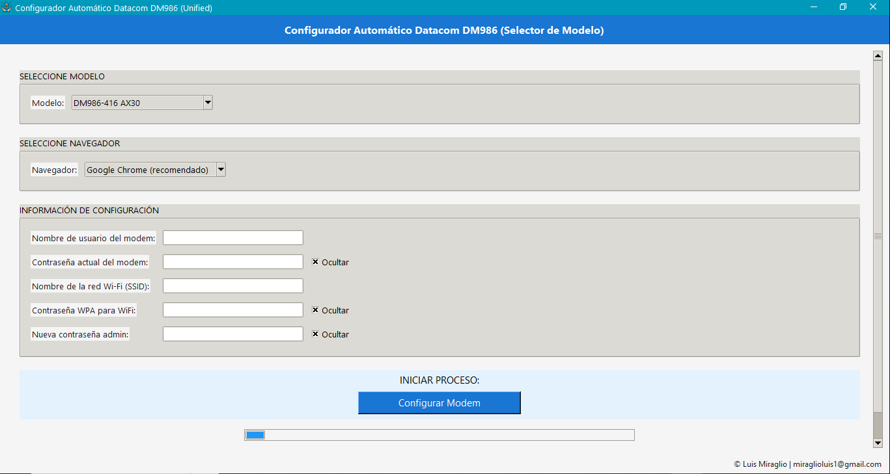

# 📡 Configurador Automático Datacom DM986 (Unified)

## 🚀 Descripción

El **Configurador Automático Datacom DM986** es una herramienta profesional desarrollada en **Python** que automatiza por completo la configuración de módems **Datacom DM986**, actualmente soportando los modelos:

- **DM986-416 AX30**
- **DM986-414**
- **DM986-414**

La aplicación utiliza **Selenium** para interactuar directamente con la interfaz web del módem y una **interfaz gráfica en Tkinter** que permite ejecutar todo el proceso de configuración de forma simple, segura y repetible.

El objetivo principal es **eliminar la configuración manual**, reducir errores humanos y acelerar los tiempos de provisión en entornos reales de producción (ISP / FTTH).

---

## 🖥️ Interfaz de la aplicación



---


## ✨ Características principales

### 🔀 Selector de modelo
- Selección manual del modelo de módem:
  - DM986-416 AX30
  - DM986-414
- La interfaz adapta automáticamente las opciones WiFi según el modelo seleccionado.

---

### 🌐 Configuración WAN automática
- Creación y configuración de:
  - **VLAN 500 (Internet)** – IPoE
  - **VLAN 600 (TR-069 / Gestión remota)** – IPoE
- Asignación automática de puertos.
- DHCP habilitado correctamente en ambos enlaces.

---

### 📶 Configuración WiFi avanzada
- Configuración completa de:
  - **WiFi 2.4GHz**
  - **WiFi 5GHz**
- Personalización opcional de:
  - Channel Width
  - Channel Number
- Valores y opciones ajustadas automáticamente según el modelo:
  - 416: soporte hasta 160 MHz
  - 414: opciones compatibles reales del equipo
- Potencia de transmisión configurada al **100%**.
- Selección automática de canales cuando no se usan valores personalizados.

---

### 🔐 Seguridad
- Configuración de:
  - Contraseña **WPA/WPA2** para WiFi
  - Cambio de contraseña de **administrador**
- Activación de **acceso remoto seguro (HTTPS)**.

---

### 🛰️ Gestión remota (TR-069)
- Configuración automática de:
  - URL del ACS
  - Credenciales de autenticación
  - Parámetros de conexión remota
- Aplicación inmediata de cambios.

---

### 🧭 Interfaz gráfica
- Interfaz moderna y clara:
  - Selector de modelo
  - Selector de navegador
  - Campos guiados
  - Barra de progreso y estado en tiempo real
- Arquitectura unificada:
  - `main.py` → UI + selector
  - `logic_416.py` → lógica específica DM986-416
  - `logic_414.py` → lógica específica DM986-414

---

## 🧩 Arquitectura del proyecto

```
Script-DATACOM-DM986/
│
├── main.py
├── logic_416.py
├── logic_414.py
├── assets/
│   └── icono.ico
├── requirements.txt
├── README.md
└── .gitignore
```

---

## 🔧 Requisitos

- Windows 10 / 11
- Python 3.8+
- Navegador instalado (Chrome recomendado)

---

## ▶️ Ejecución

```bash
python main.py
```

---

## 🛠️ Compilación (PyInstaller)

```bash
pyinstaller --onefile --noconsole ^
--icon=assets/icono.ico ^
--add-data "assets/icono.ico;assets" ^
--hidden-import=webdriver_manager.chrome ^
--hidden-import=webdriver_manager.microsoft ^
--hidden-import=webdriver_manager.firefox ^
--hidden-import=tkinter ^
--name "Configurador Datacom DM986 (Unified)" ^
main.py
```

---

## ⚠️ Consideraciones

- Diseñado para Datacom DM986 en 192.168.0.1
- Ejecutar conectado directamente al módem
- Uso técnico / interno

---

## 📞 Contacto

**Luis Miraglio**  
📧 miraglioluis1@gmail.com
