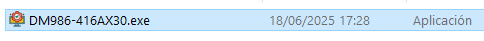

# DM986-416AX30 - Configurador Automático de Modem Datacom

## 📡 Descripción

El **Configurador Automático de Modem Datacom DM986-416AX30** es una herramienta avanzada diseñada para automatizar la configuración completa de este modelo de modem.  
Desarrollada en **Python** utilizando **Selenium** y con una interfaz gráfica amigable en **Tkinter**, esta aplicación interactúa directamente con la interfaz web del modem, ejecutando de forma automática y en un solo proceso todas las configuraciones necesarias para dejar el equipo listo para uso en entornos de producción.

El script realiza tareas críticas como:

- Configuración **WAN** con soporte para múltiples VLANs (500 y 600).
- Ajuste y optimización de las redes **WiFi** (2.4GHz y 5GHz).
- Configuración de seguridad inalámbrica y del panel de administración.
- Activación y configuración de **TR-069** para gestión remota.
- Mapeo de puertos y ajustes de rendimiento.
- Activación de acceso remoto seguro vía HTTPS.

Gracias a esta herramienta, se evita la configuración manual paso a paso y se reducen significativamente los tiempos de provisión del equipo.

## 📸 Capturas de Pantalla

### Archivo ejecutable en la carpeta dist


### Interfaz principal de la aplicación


## ✨ Características Principales

- **Configuración WAN automática**:
  - Activación de **VLAN 500** y **VLAN 600** con IPoE.
  - Configuración de modo de canal IPoE.
  - Mapeo de puertos automático para todos los puertos.

- **Configuración WiFi completa**:
  - Configuración simultánea de bandas **2.4GHz** y **5GHz**.
  - Ancho de canal optimizado:
    - 2.4GHz: 20/40MHz (modo mixto).
    - 5GHz: 160MHz.
  - Potencia de transmisión configurada al **100%**.
  - Selección automática de canales y DFS para mejor rendimiento.

- **Configuración de Seguridad**:
  - Establecimiento de contraseñas WPA para redes WiFi.
  - Cambio de contraseña de administrador.
  - Activación de acceso remoto seguro vía HTTPS.

- **Gestión remota (TR-069)**:
  - Configuración de URL del ACS.
  - Credenciales de conexión para gestión remota.
  - Aplicación automática de cambios.

- **Funciones adicionales**:
  - Interfaz gráfica intuitiva y amigable.
  - Sistema de registros (logs) con visor integrado.
  - Soporte para múltiples navegadores (Chrome, Edge, Firefox).
  - Detección automática del navegador disponible.
  - Resumen detallado de todas las operaciones realizadas.

## 🔧 Requisitos Previos

- Windows 7/8/10/11
- Python 3.6 o superior (para ejecutar desde código fuente)
- Conexión directa al modem Datacom DM986-416AX30
- Al menos uno de los siguientes navegadores:
  - Google Chrome (recomendado)
  - Microsoft Edge
  - Mozilla Firefox

## 📥 Instalación

### Opción 1: Ejecutable compilado (recomendado para usuarios finales)

1. Descarga la última versión del ejecutable desde la [sección de Releases](https://github.com/tuusuario/Script-DATACOM-DM986-416-AX30/releases)
2. Ejecuta el archivo `DM986-416AX30.exe`

### Opción 2: Desde código fuente (para desarrolladores)

1. Clona este repositorio:
   ```
   git clone https://github.com/tuusuario/Script-DATACOM-DM986-416-AX30.git
   ```

2. Instala las dependencias desde requirements.txt:
   ```
   pip install -r requirements.txt
   ```

3. Ejecuta el script:
   ```
   python DM986-416AX30.py
   ```

## 🚀 Uso

1. Inicia la aplicación ejecutando `DM986-416AX30.exe` o desde código fuente.
2. Selecciona el navegador que deseas utilizar (Google Chrome es recomendado).
3. Completa todos los campos del formulario:
   - Nombre de usuario del modem (por defecto: "admin")
   - Contraseña actual del modem
   - Nombre de red WiFi (SSID) deseado
   - Contraseña WPA para la red WiFi
   - Nueva contraseña de administrador
4. Haz clic en "Configurar Modem" para iniciar el proceso automático.
5. Espera a que se complete la configuración (la barra de progreso indicará el avance).
6. Una ventana de resumen mostrará todas las operaciones realizadas.


## 🔍 Visor de Registros

La aplicación incluye un visor de registros (logs) que puedes acceder desde el menú "Herramientas" > "Ver registros". Esta función te permite:

- Ver los registros detallados de las operaciones realizadas
- Seleccionar diferentes archivos de registro por fecha
- Solucionar problemas en caso de errores

## 🛠️ Compilación del Ejecutable

Si deseas compilar tu propia versión del ejecutable:

```
pyinstaller --onefile --noconsole --hidden-import=webdriver_manager.chrome --hidden-import=webdriver_manager.microsoft --hidden-import=webdriver_manager.firefox --hidden-import=tkinter --icon=datacom_config.ico "DM986-416AX30.py"
```

## ⚠️ Consideraciones Importantes

- Esta aplicación está diseñada específicamente para el modem Datacom DM986-416AX30
- Requiere conexión directa al modem (por cable o WiFi)
- El modem debe ser accesible en la dirección IP 192.168.0.1
- Se recomienda hacer una copia de seguridad de la configuración del modem antes de usar esta herramienta


## 📞 Contacto

Luis Miraglio - miraglioluis1@gmail.com

---

⭐ Si este proyecto te resulta útil, considera darle una estrella en GitHub! ⭐
